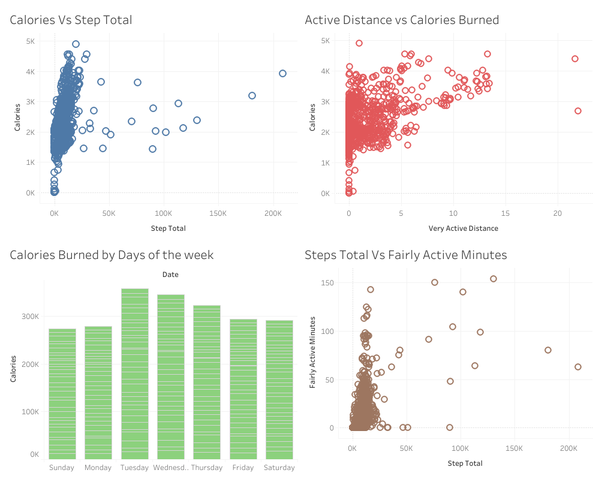

### Bellabeat Fitness Case Study: Strategic Marketing & Product Recommendations (R & Tableau)
This project analyzes consumer usage patterns in Bellabeat products (smartwatches, bracelets, and water bottles) using several parameters (Calories burned, activity, intensity, steps, etc.) to help inform strategic marketing decisions and product expansion. It serves as proof of my ability to transition operational experience into data-driven analytical insights.
### Business Problem & Goal
Bellabeat, an organization that produces wearable fitness gadgets for women, is seeking to refine its marketing strategy and plan for product expansion in the online space.
The primary goal was to use the publicly available data to:
Analyze core fitness parameters (Steps and Calories) to ascertain usage and benefits for marketing strategy.
Segment users based on activity and analyze peak activity periods to inform product feature and content recommendations.
### Methodology & Tools
The entire analysis workflow—from ingestion to final insights—was executed using a disciplined R environment with supplementary cleaning in Excel.
#### Data Cleaning & Analysis
R (using tidyverse for cleaning, manipulation, and feature engineering; ggplot2 for initial visual inspection).
Excel (For minor cleaning activity and data quality checks).
#### Visualization & Storytelling
Tableau Public (for interactive dashboarding and final presentation).
#### Key Analytical Techniques
### Data Manipulation: 
Redefined Date formats, merged datasets on primary identifiers, and summarized data based on similar characteristics.
#### Aggregation & Modeling: 
Grouped, summarized, and plotted correlations between Steps and Calories burned, identified activity peak periods over a week, and analyzed activity duration related to calories burned.
#### Key Findings (Executive Summary)
The analysis, visually anchored by plots of Steps vs. Calories burned, Steps over time, and User Activity minutes vs. Calories Burned, led to the following strategic insights:
### Findings:
#### Basal Metabolic Rate (BMR): 
Some users burn calories even with low step counts, indicating the contribution of BMR, suggesting messaging should focus on overall well-being beyond just physical activity.
#### Activity Intensity: 
Many users do not perform high-intensity activity, representing an opportunity for feature promotion.
#### Weekend Drop: 
Activity levels are significantly lower on weekends.
#### Segmentation: 
Users can be grouped into High, Medium, and Low activity levels, requiring personalized marketing outreach.
#### Deliverable: Actionable Recommendations
- Low-Step Users: Encourage increased steps via challenges and gamification features.
- Intensity: Promote short, intense workouts and features (e.g., HIIT trackers) for users avoiding high-intensity activity.
- Weekends: Target weekends with fun engagement campaigns to boost usage.
- Personalization: Personalize marketing messages based on the four distinct activity groups identified.
#### Data Source
Due to data privacy and proprietary concerns regarding the consumer records, the full raw dataset is not included in this public repository. The data structure and all variables used for column manipulation and transformation can be fully inferred by reviewing the accompanying R Code file.
### Visualization
A comprehensive dashboard was created to synthesize the findings, providing both strategic marketing and product development insights (3 distinct charts in total).

#### Live Interactive Dashboard
Explore the full, interactive version of the analysis on Tableau Public:
Primary Dashboard Link: Bellabeat Primary Dashboard
### Code Repository
The raw R Markdown file (containing the narrative and output) and the R Script (containing the raw code) are available here for full transparency and review:
R Markdown File (Narrative): [View R Markdown File](Bellabeat Case study .Rmd)
R Script File (Raw Code): [View R Script File](Bella beat case study.R)
R Script File (Raw Code): [View R Script File](Bella beat case study.R)
